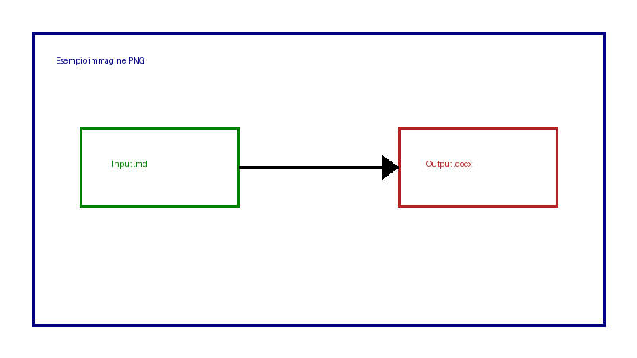
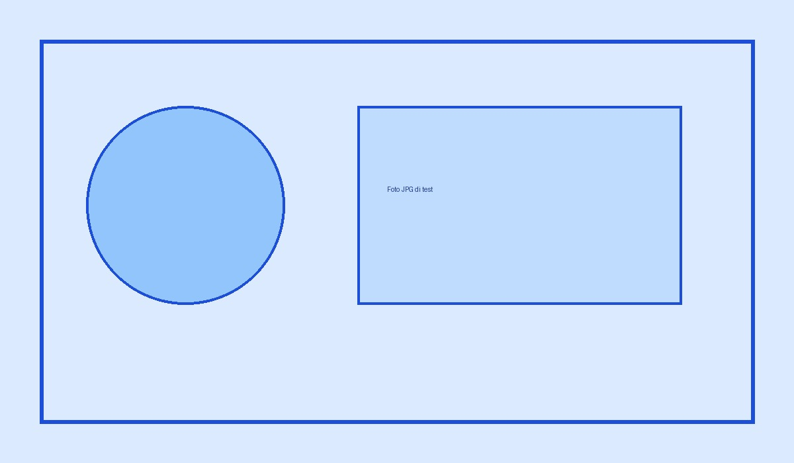

# Manuale di esempio con immagini

Questo documento serve per testare la conversione con immagini locali.

## Immagine PNG locale

## Immagine JPG locale

## Formattazione

Testo normale, *corsivo*, **grassetto** e ~~barrato~~.

- Voce 1
- Voce 2

## Tabella

| Campo | Valore |
|---|---|
| Nome | Esempio |
| Stato | OK |
